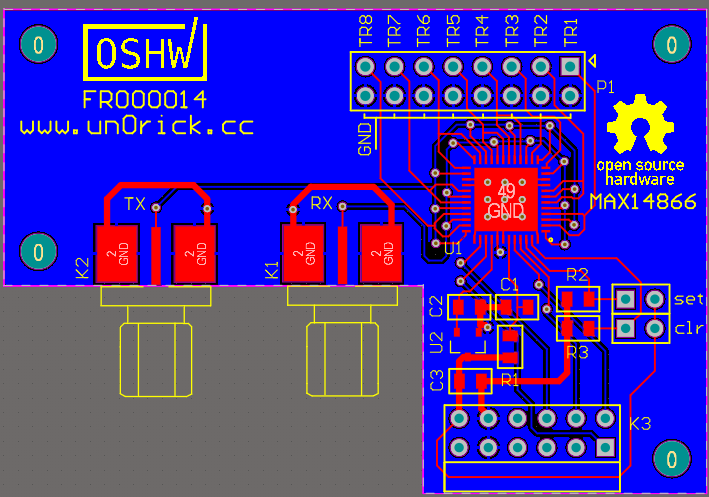

[](https://www.patreon.com/kelu124) 
[](https://ko-fi.com/G2G81MT0G)

[](https://join.slack.com/t/usdevkit/shared_invite/zt-2g501obl-z53YHyGOOMZjeCXuXzjZow)
[](http://commonmark.org)

# max14866

Breakout of max14866 




# Images


# Used with the pulse-echo board


## Testing it on a phantom 

### Setup. Inclusion at 15-30mm depth.


### Images for 25 pairs of piezos (5 piezos, 1TX/1RX each time)


### Filtered


### Details of the bottom of the phantom at 50mm


# OSHWA certified ! 

[https://certification.oshwa.org/fr000014.html](https://certification.oshwa.org/fr000014.html)

# License

See [LICENSE.txt](LICENSE.txt)

```
 ------------------------------------------------------------------------------
| SPDX-FileCopyrightText: 2020 Luc Jonveaux <kelu124@gmail.com>                |
| SPDX-License-Identifier: CERN-OHL-S-2.0                                      |
|                                                                              |
| This source describes Open Hardware and is licensed under the CERN-OHL-S v2. |
|                                                                              |
| You may redistribute and modify this source and make products using it under |
| the terms of the CERN-OHL-S v2 (https://ohwr.org/cern_ohl_s_v2.txt).         |
|                                                                              |
| This source is distributed WITHOUT ANY EXPRESS OR IMPLIED WARRANTY,          |
| INCLUDING OF MERCHANTABILITY, SATISFACTORY QUALITY AND FITNESS FOR A         |
| PARTICULAR PURPOSE. Please see the CERN-OHL-S v2 for applicable conditions.  |
|                                                                              |
| Source location: https://github.com/kelu124/max14866/                        |
|                                                                              |
| As per CERN-OHL-S v2 section 4, should You produce hardware based on this    |
| source, You must where practicable maintain the Source Location visible      |
| on the external case of the Gizmo or other products you make using this      |
| source.                                                                      |
 ------------------------------------------------------------------------------
```

[More details in cern_ohl_s_v2](https://ohwr.org/project/cernohl/wikis/Documents/CERN-OHL-version-2)


* The software components are free software: you can redistribute it and/or modify it under the terms of the GNU General Public License as published by the Free Software Foundation, either version 3 of the License, or (at your option) any later version.
* The documentation is licensed under a [Creative Commons Attribution-ShareAlike 3.0 Unported License](http://creativecommons.org/licenses/by-sa/3.0/).

## Disclaimer

This project is distributed WITHOUT ANY EXPRESS OR IMPLIED WARRANTY, INCLUDING OF MERCHANTABILITY, SATISFACTORY QUALITY AND FITNESS FOR A PARTICULAR PURPOSE.


